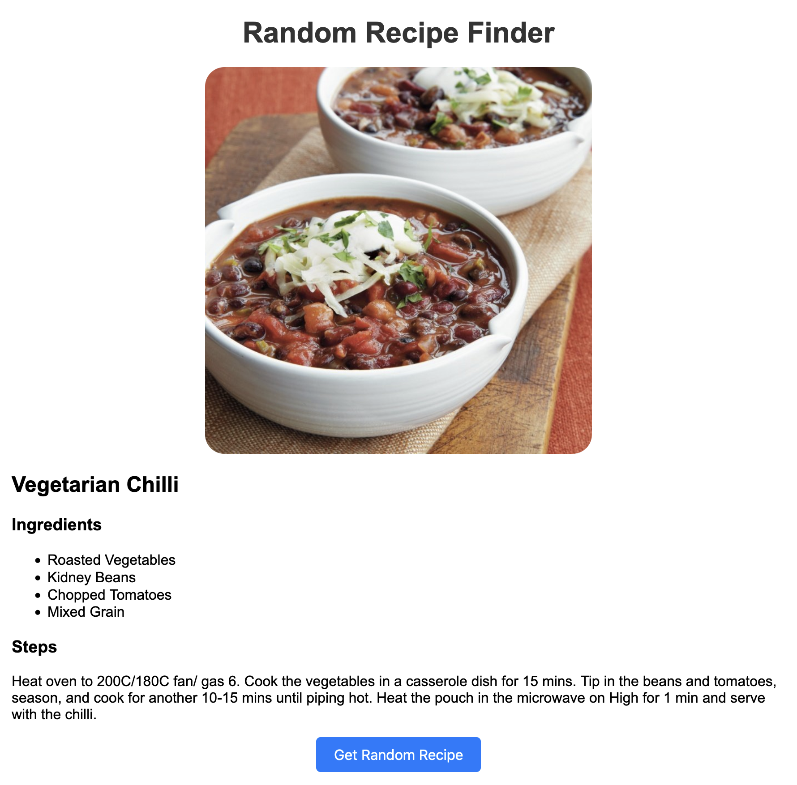

# [Random Recipe Finder 🔗](https://revou-fsse-5.github.io/module-3-sutoro/)
The project uses JavaScript to fetch a random recipe from TheMealDB API and dynamically display it on the web page. 

The code implements `async/await` to handle asynchronous operations, specifically fetching data from TheMealDB API. This approach makes the code more readable and easier to understand compared to using traditional promise-based callbacks.

**Async**:
- Marks a function as asynchronous, meaning it can handle promises without blocking the execution of other code.
- Automatically returns a promise.

**Await**:
- Can only be used within an async function.
- Pauses the execution of the async function until the promised value is available.
- Returns the resolved value of the promise.

## Implemented Functionality
- **Button and Container**: The code first retrieves the button element with the ID getRecipeBtn and the container element with the ID recipeContainer from the HTML document.
- **Event Listener**: An event listener is added to the button, which triggers a function when the button is clicked.
- **Fetching the Recipe**: Inside the function, the code makes an asynchronous request to TheMealDB API using the fetch function. It then awaits the response and parses it as JSON.
- **Creating Recipe Details**: The retrieved recipe data is used to dynamically create an HTML structure containing the recipe image, name, ingredients list, and instructions.
- **Displaying the Recipe**: Finally, the generated HTML string is set as the inner HTML of the recipeContainer element, showcasing the recipe on the web page.
- **Error Handling**: The code includes error handling to gracefully handle potential issues during the API call. If an error occurs, it displays a user-friendly message in the recipe container.
## Screenshot

